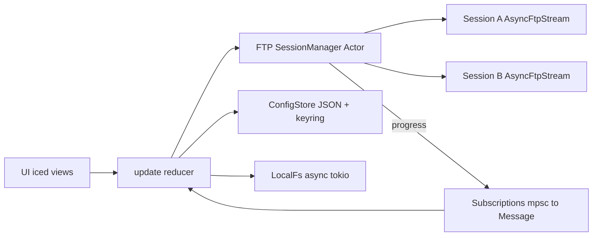

# Plan de mejora — MielFTP

Documento de referencia del plan de auditoría y desarrollo. Objetivo: cliente FTP con paridad funcional respecto a **FileZilla**, manteniendo estilo visual tipo **shadcn / Cursor / Claude** (oscuro, tipografía compacta, acento miel).

> Estado del código: revisar también el [roadmap en README.md](README.md#roadmap) con checklist actualizado.

---

## Estado actual del proyecto

- Stack: Rust edition 2024, **Iced 0.14**, **Tokio**, **suppaftp**, **serde**, **keyring**, **secrecy**, **tracing**
- MVP operativo: listar local/remoto, subir/bajar un archivo, Site Manager persistido
- Deuda conocida: cada operación FTP abre/cierra conexión; transferencias cargan el archivo entero en RAM

---

## Arquitectura objetivo

Hoy `update` invoca funciones en `ftp::client` que hacen **connect + login + … + quit** en cada operación. La meta es un **actor por conexión** con sesión persistente, progreso por `Subscription` y cola de transferencias.

---

## Hallazgos por capa (auditoría)

### A. Capa FTP — `src/ftp/client.rs`

| ID | Severidad | Hallazgo | Estado |
|----|-----------|----------|--------|
| A1 | Crítico | Reconectar en cada operación | Pendiente → actor `FtpSession` |
| A2 | Crítico | Upload/download cargan archivo entero en RAM | Pendiente → streaming |
| A3 | Crítico | Sin progreso real (`TransferProgress` no emitido) | Pendiente → `Subscription` |
| A4 | — | Sin FTPS (`into_secure()` nunca llamado) | Pendiente |
| A5 | — | Sin SFTP (fuera de `suppaftp`) | Pendiente / decisión alcance |
| A6 | — | Parser LIST custom frágil | **Hecho** → `suppaftp::list::File` |
| A7 | — | Sin timeouts en operaciones de red | Pendiente |
| A8 | — | Imports / warnings menores | **Hecho** |
| A9 | — | Acoplamiento `crate::app` en ftp/ui | **Hecho** → `crate::models` |

### B. Estado y reducer — `src/app.rs`

| ID | Hallazgo | Estado |
|----|----------|--------|
| B1 | Credenciales hardcodeadas en boot | **Hecho** → `config::store` |
| B2 | Módulo `config/` vacío | **Hecho** |
| B3 | Catch-all `_ => Task::none()` | **Hecho** → match exhaustivo |
| B4 | `find().cloned()` repetido | **Hecho** → `State::connection_cloned` |
| B5 | Selección solo por nombre (sin multi-select) | Pendiente |
| B6 | `theme(state)` sin usar state | **Hecho** |
| B7 | Paths locales con `format!` (Windows) | **Hecho** → `PathBuf::push` |
| B8 | Errores solo en consola | Parcial → banner `status_message` |
| B9 | Una sola transferencia activa | Pendiente → cola |

### C. UI / UX — `src/ui/`

| ID | Hallazgo | Estado |
|----|----------|--------|
| C1 | Sin formulario de conexión | **Hecho** → modal Site Manager |
| C2 | Barra de progreso falsa (● ● ●) | Pendiente |
| C3 | Sin cola de transferencias | Pendiente |
| C4 | Sin drag & drop | Pendiente |
| C5 | Sin selección múltiple | Pendiente |
| C6 | Sin menú contextual | Pendiente |
| C7 | Sin breadcrumbs | Pendiente |
| C8 | Sin ordenar columnas | Pendiente |
| C9 | Sin filtro/búsqueda | Pendiente |
| C10 | Sin atajos de teclado | Pendiente |
| C11 | Empty states pobres | Parcial |
| C12 | Sin status bar (conteo, tamaño total) | Pendiente |
| C13 | Visor log FTP | **Hecho** → opcional, toggle (no siempre visible) |
| C14 | Iconos genéricos (emojis) | Pendiente → SVG / icon font |
| C15 | Sin cancelar transferencia | Pendiente |
| C16 | Sin cancelar conexión en `Connecting` | Pendiente |
| C17 | Ajustes cosméticos transfer bar | Parcial |

### D. Seguridad

| ID | Hallazgo | Estado |
|----|----------|--------|
| D1 | Password en texto plano | **Hecho** → `secrecy` + keyring |
| D2 | `Debug` filtra password | **Hecho** |
| D3 | JSON sin cifrado + escritura atómica | **Hecho** (password fuera del JSON; `rename` atómico) |

### E. Idiomatic Rust

| ID | Hallazgo | Estado |
|----|----------|--------|
| E1 | `Result<T, String>` | **Hecho** → `AppError` + `AppErrorMsg` |
| E2 | `.clone()` de `Connection` (password) | Parcial (sigue clonándose; mitigar con actor) |
| E3 | Re-exports cruzados en `app` | **Hecho** |
| E4 | Validación de conexión | **Hecho** → `Connection::try_new` |
| E5 | Catch-all en `update` | **Hecho** |
| E6 | `home_dir` silencioso | **Hecho** → fallback con `warn!` |
| E7 | Helpers visuales repetidos | Pendiente → `ui/widgets/` |

### F. Tooling

| ID | Hallazgo | Estado |
|----|----------|--------|
| F1 | README | **Hecho** |
| F2 | Licencia | **Hecho** (MIT) |
| F3 | CI | **Hecho** → `.github/workflows/ci.yml` |
| F4 | `clippy.toml` / reglas pedantic | Parcial (`clippy -D warnings`) |
| F5 | Tests | **Hecho** (store + parser LIST) |
| F6 | `eprintln!` | **Hecho** → `tracing` |
| F7 | Metadata `Cargo.toml` | **Hecho** |

### G. Paridad FileZilla (features)

Ver checklist completo en [README.md — Roadmap](README.md#roadmap).

---

## Roadmap por fases

### Fase 1 — Bases sólidas (deuda + Site Manager) ✅

Entregable independiente; **completada** salvo mejoras menores de UX.

- [x] `AppError` tipado y propagación en mensajes iced
- [x] Match exhaustivo en `update`
- [x] Imports por capas (`models` / `ftp` / `ui`)
- [x] `State::connection` / `connection_cloned`
- [x] Persistencia `sites.json` (escritura atómica)
- [x] Modal Site Manager (crear / editar / eliminar)
- [x] `secrecy` + `keyring`
- [x] `tracing` + `tracing-subscriber`
- [x] Parser LIST con `suppaftp::list::File`
- [x] Rutas locales con `PathBuf`
- [x] README, LICENSE, CI, tests básicos
- [x] Log FTP **opcional** (toggle; no siempre visible)

### Fase 2 — Sesión real + cola de transferencias

- [ ] Actor `FtpSession` por conexión (`mpsc` de comandos)
- [ ] Upload/download por streaming (sin OOM)
- [ ] `Subscription` → `Message::TransferProgress` con barra real
- [ ] `TransferQueue` (pendiente / activa / hecha / fallida)
- [ ] Cancelar y reintentar transferencias
- [ ] Timeouts y reintentos automáticos en red

### Fase 3 — Paridad FileZilla (UX)

- [ ] Drag & drop (`window::Event::FileDropped`)
- [ ] Selección múltiple, atajos, menú contextual
- [ ] Breadcrumbs, ordenar columnas, filtro/búsqueda
- [ ] Mkdir, rename, delete (local y remoto)
- [ ] Resume con comando `REST`
- [ ] Mejoras empty states, status bar, iconografía SVG

### Fase 4 — Seguro y avanzado

- [ ] FTPS explícito (`into_secure()`)
- [ ] SFTP (opcional; p. ej. `russh-sftp`)
- [ ] Sincronizar / comparar directorios
- [ ] Edición remota (temp + re-upload on save)
- [ ] Throttling de ancho de banda
- [ ] Filtros por patrón (`.DS_Store`, `node_modules`, …)
- [ ] Quickconnect, bookmarks, modo activo/pasivo

---

## Notas de estilo (shadcn / Cursor / Claude)

**Ya aplicado:**

- Paleta oscura (`#111` base, `#161` surface), acento miel `#c9a84c`
- Tipografía 11–13px, espaciado 6/8/12
- Bordes sutiles, filas hover/selected

**Pendiente para “feel” Cursor/Claude:**

- Transiciones suaves en hover
- Skeleton / loading en listados (no solo “Offline”)
- Toasts para errores y éxito (hoy banner + log)
- Modal Site Manager alineado con más feedback visual
- Sustituir emojis 💻🖥📁 por iconos escalables (SVG)

---

## Decisiones de diseño registradas

1. **Log FTP:** no permanente en pantalla; botón **log FTP** en la barra inferior para mostrar/ocultar panel (~140px).
2. **Contraseñas:** nunca en `sites.json`; solo en keyring (`miel-ftp` + UUID de conexión).
3. **Errores en UI:** `status_message` (banner) + entradas en log FTP; `tracing` para depuración en terminal.

---

## Referencia de archivos clave

| Área | Archivos |
|------|----------|
| Reducer | `src/app.rs` |
| Estado | `src/models/state.rs`, `message.rs` |
| FTP | `src/ftp/client.rs` |
| Config | `src/config/store.rs` |
| Site Manager | `src/ui/connection_modal.rs` |
| Log FTP | `src/models/ftp_log.rs`, `src/ui/ftp_log_panel.rs` |
| Tema | `src/ui/theme.rs` |

---

*Última actualización: alineado con la implementación post-auditoría (Fase 1 + log FTP opcional).*
